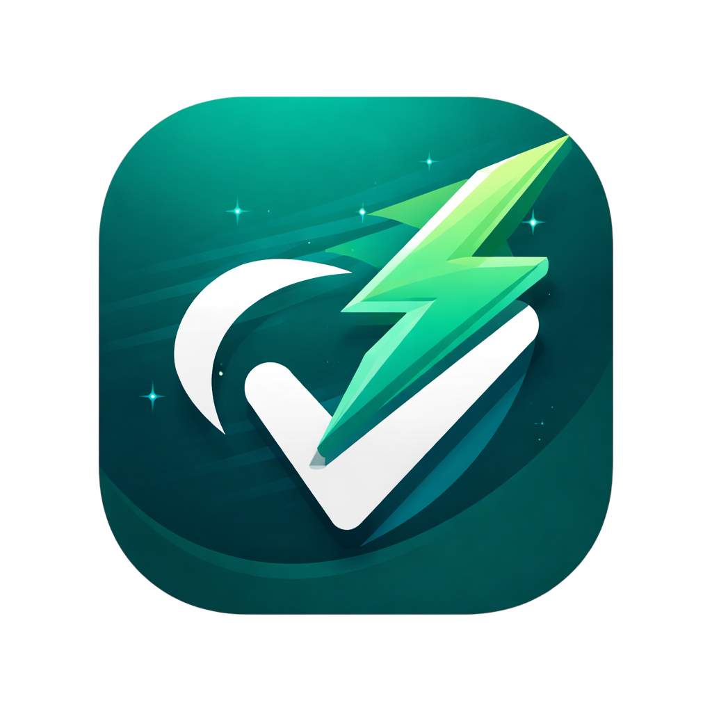

# FastVote

로그인 없이 링크 하나로 시작하는 실시간 익명 투표 플랫폼입니다.  
빠르게 질문을 만들고, 바로 공유하고, 결과를 즉시 확인할 수 있습니다.

Live Demo: https://fastvote.geekgoing.org/



## 왜 만들었나

FastVote는 "지금 당장 의견을 모아야 하는 상황"을 위해 만들었습니다.

- 회원가입 없이 바로 시작
- 모바일에서도 바로 투표
- 결과를 실시간으로 확인
- 투표 종료 시점(TTL) 자동 관리

## 핵심 기능

- **초간단 생성**: 제목/선택지만 입력하면 UUID 기반 투표 링크 생성
- **실시간 반영**: WebSocket으로 새로고침 없이 결과 업데이트
- **유연한 공개 범위**: 공개/비공개, 비밀번호 보호, 태그 분류 지원
- **참여 확장**: 익명 댓글, 복수 선택, 한국어/영어, 다크 모드 제공

## 사용 시나리오

- 팀 회의에서 빠른 의사결정
- 스터디/커뮤니티에서 익명 선호도 조사
- 행사 아이스브레이킹 또는 즉석 Q&A

## 빠르게 실행하기

```bash
docker-compose up -d
```

- Frontend: `http://localhost:3000`
- Backend API: `http://localhost:8000`
- API Docs: `http://localhost:8000/docs`

자세한 실행 방법은 `docs/getting-started.md`에서 확인할 수 있습니다.

## 배포 주소

- Production: `https://fastvote.geekgoing.org/`

## 문서

- `docs/README.md`: 문서 인덱스
- `docs/architecture.md`: 시스템 아키텍처
- `docs/tech-stack.md`: 기술 스택
- `docs/api.md`: API 엔드포인트
- `docs/project-structure.md`: 프로젝트 구조
- `docs/getting-started.md`: 로컬 개발/실행 가이드

## License

MIT
