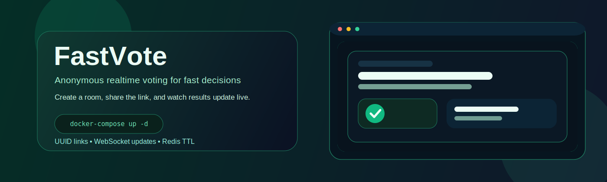

<p align="center">
  
</p>

<h1 align="center">FastVote</h1>

<p align="center">
  Anonymous realtime voting for situations where a decision needs to happen now.
</p>

<p align="center">
  <a href="https://fastvote.geekgoing.org/"></a>
  <a href="#quick-start"></a>
  <a href="#quick-start"></a>
  <a href="#quick-start"></a>
</p>

<p align="center">
  <code>docker-compose up -d</code>
</p>

FastVote removes sign-up friction from short-lived voting. Create a poll, share the link, and watch results update live.

## At a Glance

- UUID-based room creation with anonymous participation
- Redis-backed TTL lifecycle plus WebSocket result updates
- Public/private polls, password protection, comments, and multi-select support

## Screenshot


## Why FastVote

- Short-lived decisions need less setup, not more
- Result updates are designed around immediacy instead of refresh cycles
- The product supports both casual community use and structured team voting

## Core Features

- Anonymous poll creation
- Live result updates over WebSocket
- Public / private visibility controls
- Password-protected polls
- Multi-select voting
- Anonymous comments
- Korean / English locale support
- Dark mode

## Quick Start

```bash
docker-compose up -d
```

Local services:

- Frontend: `http://localhost:3000`
- Backend API: `http://localhost:8000`
- API docs: `http://localhost:8000/docs`

For more setup detail, see `docs/getting-started.md`.

## Usage

1. Create a poll from `/create`
2. Share the generated room link
3. Watch live results without refreshing
4. Optionally restrict access with visibility or password rules

## Project Structure

- `frontend/`: Next.js application
- `backend/`: FastAPI API and WebSocket server
- `docs/`: architecture, setup, API, and project notes

## Contributing

Local checks:

```bash
cd frontend && npm run lint
cd frontend && npm run test:e2e
cd backend && uv run pytest
```

Issue reports should include:

- Browser and OS
- Reproduction steps
- Expected vs actual behavior
- Whether the issue happened in frontend UI, backend API, or WebSocket updates

Recommended commit prefixes: `feat`, `fix`, `docs`, `refactor`, `test`, `chore`

## License

MIT
